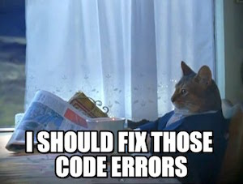

---

---

# JavaEE
A repo to organize JavaEE projects and assignments

---

---

---

###Class Home 
- [Home](https://github.com/MadJavaEntFall2016/home)
- [Course Calendar](https://github.com/MadJavaEntFall2016/home/blob/master/CourseCalendar.md)

###Class Work
-[Activity 2: SOAP Demo Test](https://github.com/tkinsman/toddSoapDemo)
-[Activity 3: Old SOAP with NOAA/NDFD](https://github.com/tkinsman/ndfdDemo)

###Student Home 
- [Student Pages](https://github.com/MadJavaEntFall2016/student)
- [Web Services/APIs](http://www.programmableweb.com/)

###Individual Project Repo Links
- [StaShit](https://github.com/tkinsman/StaShit)
- [Individual Time Log](https://github.com/tkinsman/storeShare/blob/master/timeLog.md) 

HTML Themes I Like
- [All From Bootstrap](https://startbootstrap.com/template-categories/all/)
- [Agency](https://github.com/BlackrockDigital/startbootstrap-agency)
- [Bare Bones](https://blackrockdigital.github.io/startbootstrap-scrolling-nav/)

###Group Project Repo Links
- [Add Group Repo Once Created--Currently Empty]()
- [Group Time Log-- Currently Empty]()

### Helpful Resources
- [Data Generator](http://www.yandataellan.com/)
- [Weather API](https://alerts.weather.gov/)
- [Bootsnipp Templates](http://bootsnipp.com/)
- [Markdown Live Editor](http://dillinger.io/)
